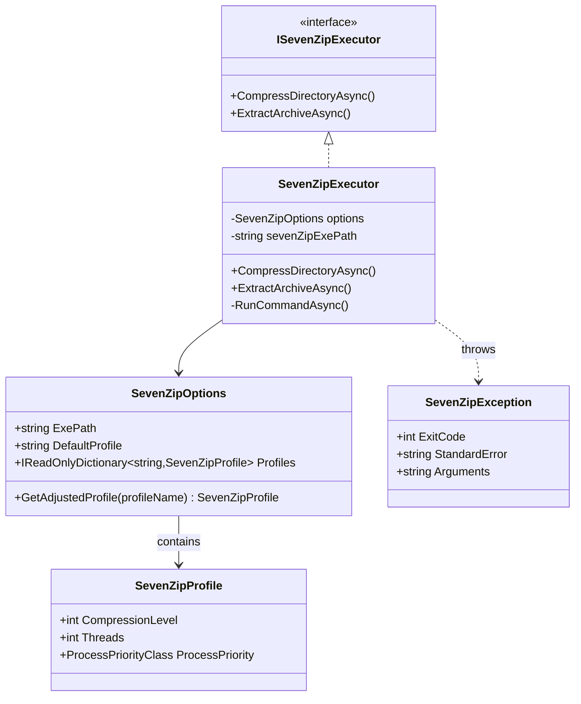
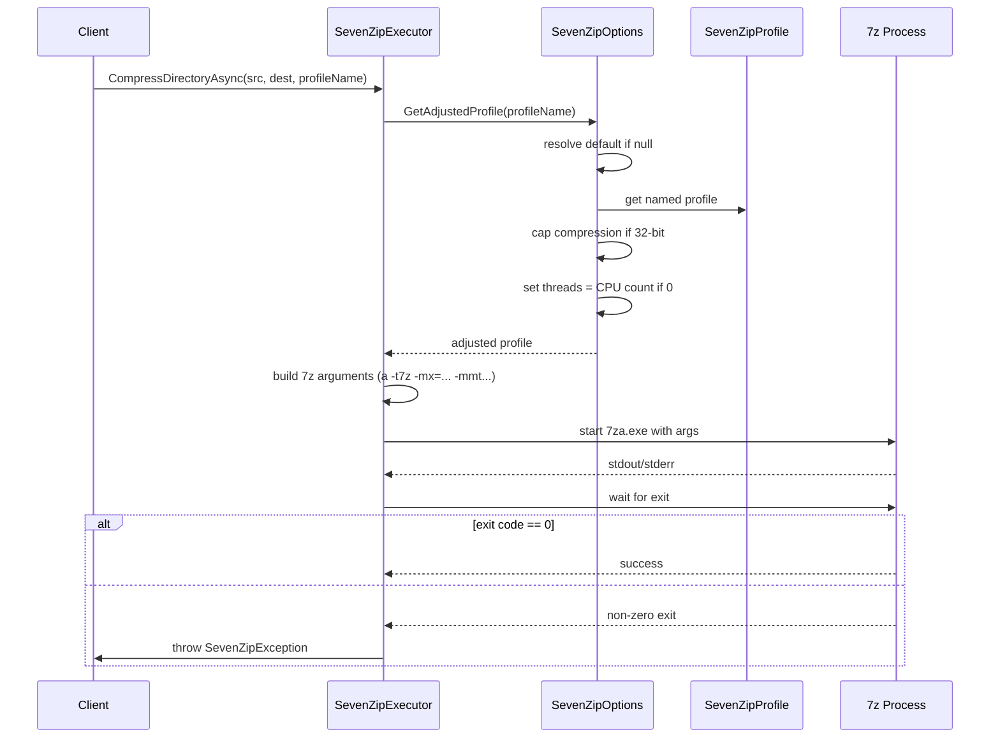
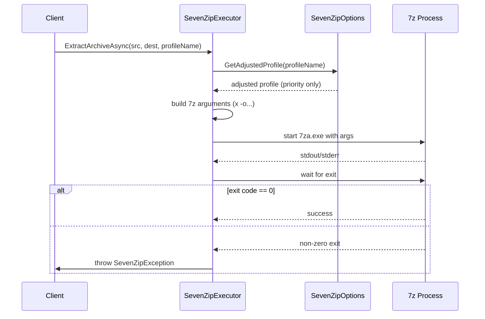
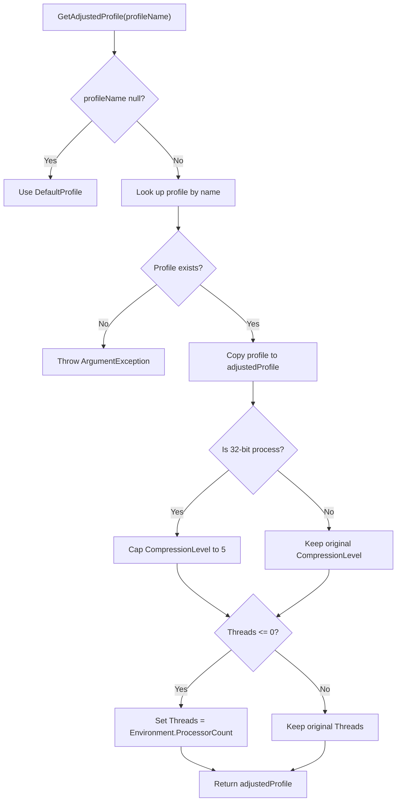
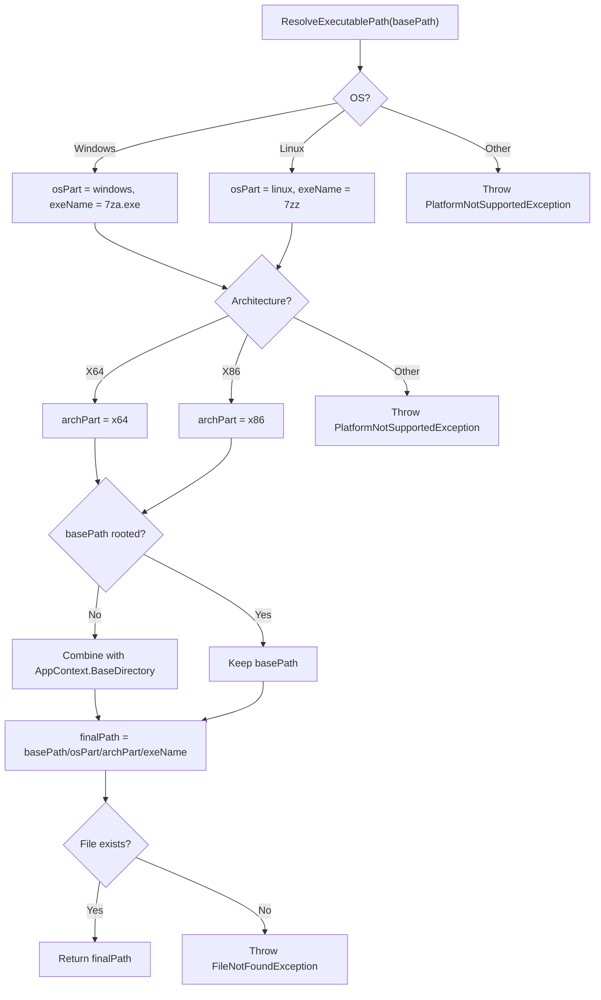

# SevenZipRunner

A lightweight .NET library for invoking 7‑Zip (7za/7zz) from managed code, with platform‑aware profiles for compression and extraction.

The library embeds native 7‑Zip executables for Windows and Linux (x86 and x64) and exposes a simple async API. It supports named compression profiles (e.g., `Balanced`, `MaxCompression`, `LogArchiving`) and automatically adjusts parameters based on the runtime environment (OS, architecture, CPU count) to avoid crashes and balance resource usage.

---

## Features

- **Compression & extraction** – wrap directories into `.7z` archives, and extract archives to a target folder.
- **Named profiles** – define compression level, thread count, and process priority per profile; choose a profile per call or use a default.
- **Platform‑aware tuning** – caps compression level to 5 on 32‑bit processes (prevents out‑of‑memory), and resolves `Threads = 0` to the actual processor count.
- **Embedded binaries** – includes 7‑Zip executables for Windows (`7za.exe`, `7za.dll`) and Linux (`7zz`, `7zzs`) for x86 and x64; binaries are copied to the output directory.
- **Async API** – all operations are cancellable via `CancellationToken`.
- **Structured error reporting** – throws `SevenZipException` with exit code, arguments, and standard error.

---

## Class Diagram – Core Types & Relationships



---

## Installation

Install the [SevenZipRunner NuGet package](https://www.nuget.org/packages/SevenZipRunner):

```bash
dotnet add package SevenZipRunner
```

The package targets .NET 6.0, 7.0, 8.0, 9.0, and 10.0.

---

## Usage

### 1. Register with dependency injection (optional)

If you use `Microsoft.Extensions.DependencyInjection`, register the executor with your configuration:

```csharp
using SevenZip;
using Microsoft.Extensions.DependencyInjection;
using Microsoft.Extensions.Configuration;

// In your startup
services.Configure<SevenZipOptions>(configuration.GetSection("SevenZip"));
services.AddSingleton<ISevenZipExecutor, SevenZipExecutor>();
```

### 2. Direct instantiation

```csharp
var options = new SevenZipOptions
{
    ExePath = "SevenZip",           // default – relative to base directory
    DefaultProfile = "Balanced"
};
var executor = new SevenZipExecutor(options);
```

### 3. Compress a directory

```csharp
await executor.CompressDirectoryAsync(
    sourceDirectory: @"C:\data\logs",
    destinationArchive: @"C:\backups\logs.7z",
    profileName: "LogArchiving",      // optional; falls back to DefaultProfile
    cancellationToken: default
);
```

#### Compression Workflow (Sequence Diagram)



### 4. Extract an archive

```csharp
await executor.ExtractArchiveAsync(
    sourceArchive: @"C:\backups\logs.7z",
    destinationDirectory: @"C:\restore\logs",
    profileName: "Balanced",
    cancellationToken: default
);
```

#### Extraction Workflow (Sequence Diagram)



---

## Configuration

The library uses the options pattern. All settings are defined in `SevenZipOptions`.

### `SevenZipOptions` properties

| Property         | Type                                           | Default                       | Description                                                                            |
| ---------------- | ---------------------------------------------- | ----------------------------- | -------------------------------------------------------------------------------------- |
| `ExePath`        | `string`                                       | `"SevenZip"`                  | Base path (absolute or relative) where the OS/architecture‑specific subfolders reside. |
| `DefaultProfile` | `string`                                       | `"Balanced"`                  | Name of the profile used when no `profileName` is supplied.                            |
| `Profiles`       | `IReadOnlyDictionary<string, SevenZipProfile>` | Built‑in profiles (see below) | Named compression profiles.                                                            |

### `SevenZipProfile` properties

| Property           | Type                   | Default  | Description                                                                                         |
| ------------------ | ---------------------- | -------- | --------------------------------------------------------------------------------------------------- |
| `CompressionLevel` | `int`                  | `5`      | 1 (fastest) – 9 (ultra). On 32‑bit processes, values >5 are capped to 5.                            |
| `Threads`          | `int`                  | `0`      | Number of threads; `0` means “use all cores” (resolved at runtime to `Environment.ProcessorCount`). |
| `ProcessPriority`  | `ProcessPriorityClass` | `Normal` | Priority class for the 7‑Zip process.                                                               |

#### Platform‑Aware Adjustment Flowchart



### Default profiles

| Name                | Compression | Threads | Priority    |
| ------------------- | ----------- | ------- | ----------- |
| `Balanced`          | 5           | 0       | Normal      |
| `Fastest`           | 1           | 0       | BelowNormal |
| `MaxCompression`    | 9           | 0       | Normal      |
| `LogArchiving`      | 1           | 2       | BelowNormal |
| `LuceneIndexBackup` | 7           | 0       | Normal      |

### Customising profiles

You can override the built‑in profiles or add new ones in your configuration file (e.g., `appsettings.json`):

```json
{
  "SevenZip": {
    "ExePath": "SevenZip",
    "DefaultProfile": "Balanced",
    "Profiles": {
      "Balanced": {
        "CompressionLevel": 5,
        "Threads": 0,
        "ProcessPriority": "Normal"
      },
      "Fastest": {
        "CompressionLevel": 1,
        "Threads": 0,
        "ProcessPriority": "BelowNormal"
      }
    }
  }
}
```

> **Note:** `ProcessPriority` is parsed from the string values defined in `System.Diagnostics.ProcessPriorityClass`.

### Platform‑aware adjustments

- **32‑bit memory constraint**: If the current process is 32‑bit (`!Environment.Is64BitProcess`), the compression level is capped at 5 to avoid exceeding the 2 GB address space.
- **Thread count**: A value of `0` is replaced with `Environment.ProcessorCount` at runtime.

---

## Error handling

All synchronous and asynchronous operations throw a `SevenZipException` if the underlying 7‑Zip process returns a non‑zero exit code.

```csharp
try
{
    await executor.CompressDirectoryAsync(...);
}
catch (SevenZipException ex)
{
    Console.WriteLine(ex.Message);
    Console.WriteLine($"Exit code: {ex.ExitCode}");
    Console.WriteLine($"Standard error: {ex.StandardError}");
    Console.WriteLine($"Arguments: {ex.Arguments}");
}
```

---

## Platform support

- **Windows**: x86 and x64 (uses `7za.exe`).
- **Linux**: x86 and x64 (uses `7zz`).

Other operating systems and architectures are not supported; a `PlatformNotSupportedException` is thrown when constructing the executor.

The required native binaries are included in the package under the `SevenZip` folder and are automatically copied to the output directory during build.

### Executable Resolution Flowchart



---

## License

This project is licensed under the [MIT License](LICENSE).

---

## Contributing

Issues and pull requests are welcome. Please ensure that changes are covered by tests and follow the existing coding style.

---

## Acknowledgements

This library bundles the [7‑Zip](https://www.7-zip.org/) executables (p7zip for Linux) under their respective licenses. The `7za.exe` and `7zz` files are redistributed as part of the NuGet package.
